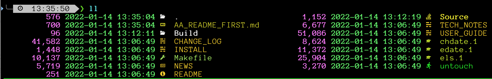

# els - Extended LS
## History
This is a fork of the work found at:

- els-1.54a1.tar.gz from http://els-software.org

I have modified it for my own person use.

*No claims are made to the reliability or safety of those changes.*

Extended LS is a very extended version of 'ls' by the original author.  I have only made a few minor tweaks, such as adding color and glyph support.

README-ORIG is the original README from els-software.org.
All of the other text files and documentation are unmodified from the original source.

## Compiling
This has compiled on OS X, Big Sur, not tested on other platforms.

- make config
- make all

binaries will be in:  Build/els/bin

## Features
- add commas to file sizes
- colorize file size column
- colorize date/time by age
- add glyphs to show file types

## Using
These are zsh functions I use to call it.

Note: You will need to remove the "| mc" or also install it.
mc turns "line" output into multi-columns

- ```l  () { els +T^NY-M-DT +G~Atp~ugsmNL $@ }```


- ```ll () { els +T^NY-M-DT +G~At~smN $@ | mc }```


- ```ls () { els +G~t~N $@ | mc }```


- ```lt () { els +T^NY-M-DT +G~At~smN -rt $@ | mc }```


## Glyph Support

els uses the environment variable $LS_ICONS to define the colors and glyphs for file types.

The file ls_colors_generator.py is used to define those file types.

This is based on: https://github.com/mnurzia/even-better-ls
where 'based on' == 'copied from'

Despite ls_colors_generator.py being a python program, the contents is only read by ls_icons_generator, never executed.

ls_icons_generator ingests both original ls $LS_COLORS and ls_colors_generator.py to create LS_ICONS.cfg

load_lsicons() loads $LS_ICONS from LS_ICONS.cfg.
If ls_colors_generator.py is newer than LS_ICONS.cfg, it will regenerate LS_ICONS.cfg first.

These tools were written for my personal use.
My *rc and init scripts are kept in $HOME/.rc

load_lsicons() reads and writes into $HOME/.rc/etc
## ZSH OMZ plugin with hide/unhide

Creates several functions with els options I find useful

Newest addition is a hide/unhide command to tell els to exclude files with specified extensions as demonstrated:


